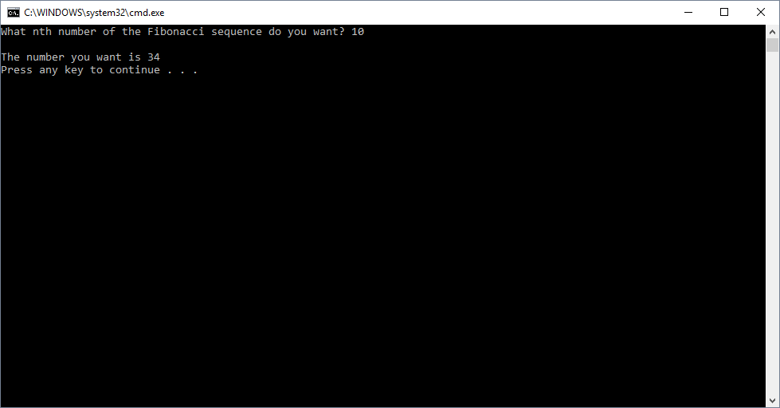

# Fibonacci Numbers

## Challenge
This challenge is extra credit. Write a function that takes in an integer. This function takes the integer and returns the nth number of the Fibonacci sequence based on the integer given.

## Approach & Efficiency

1. Big O Time = O(n)
	- This solution loops an n number of times to generate Fibonacci numbers

2. Big O Space = O(n)
	- This solution instantiates 3 integer variables to help with generating Fibonacci numbers

## Solution Output

