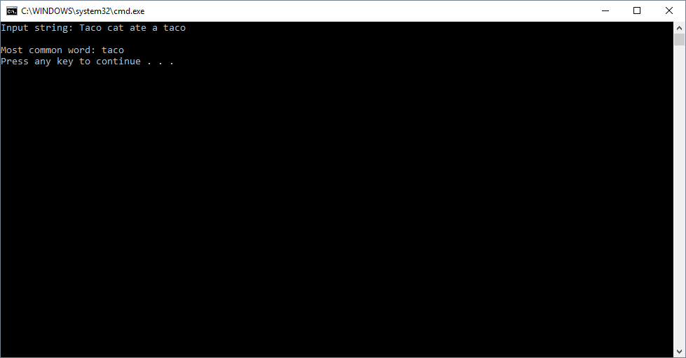

# Most Common Word

## Challenge
Create a method called MostCommonWord that takes in a long string as input. This method should utilize a hash table to find the most common word appearing in the input string. After the method determines the most repeated word, it should return that word as a string.

## Approach & Efficiency
Big O Time = O(n) 
- This method needs to iterate over an array of strings to check if the strings exist in a hash table and add them to the hash table if they do not exist.

Big O Space = O(n) 
- This method requires the instantiation of a new hash table, string array, int variable, and string variable.

## Input/Output Visual

