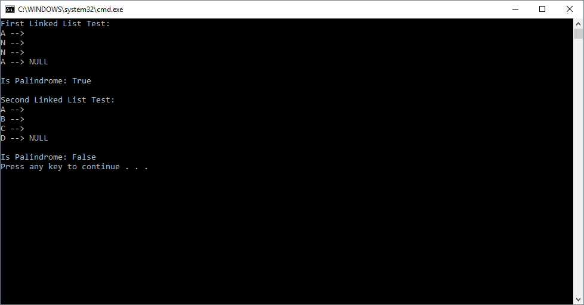

# Check If Linked List Is Palindrome

## Challenge
This challenge is extra credit. Write a function that takes in a linked list. This function takes the linked list, checks if it is a palindrome, and returns true or false based on the results.

## Approach & Efficiency

1. Big O Time = O(n)
	- This solution traverses the input linked list and the current node's value to a string variable

2. Big O Space = O(n)
	- This solution creates a string variable to be tested whether or not linked list is a palindrome

## Solution Output

