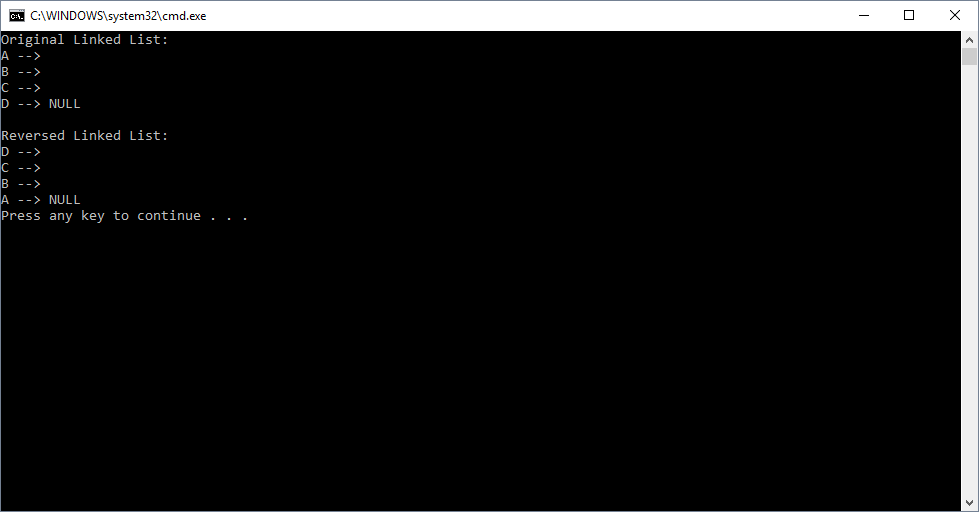

# Reverse A Linked List

## Challenge
This challenge is extra credit. Write a function that takes in a linked list. This function takes the linked list, reverses it in place, and returns the reversed linked list.

## Approach & Efficiency

1. Big O Time = O(n)
	- This solution traverses the input linked list and changes the pointers of the nodes

2. Big O Space = O(1)
	- This solution reverses the linked list in place without needing to create another linked list with new nodes

## Solution Output

