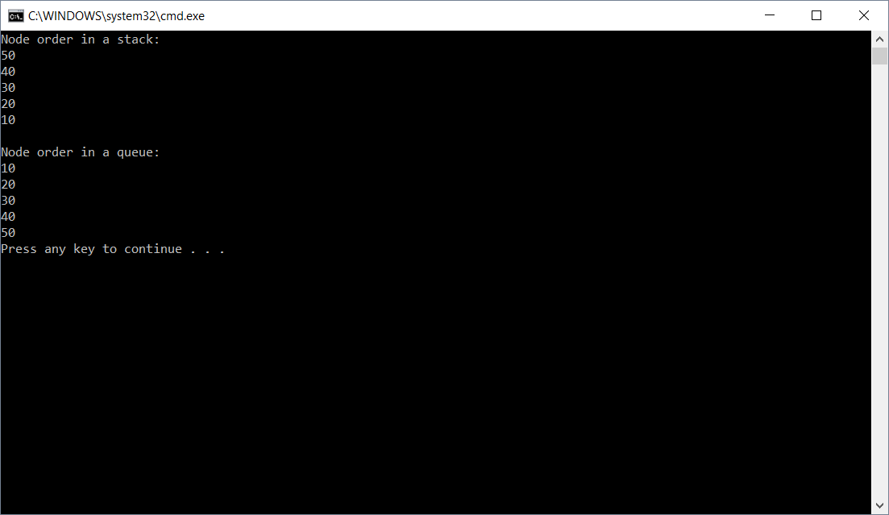

# Stacks and Queues

## Description/Challenge
Implement a stack and a queue with functionality to Peek, Push, and Pop to a stack and to Peek, Enqueue, and Dequeue to a queue. The project should have a Node class with a Value and Next property. The project should also include a Stack class with a Top property with associated methods as well as a Queue class that has both a Front and Rear property with associated methods.

## Linked List Methods
### Stack
Big O - 
Time: O(1) 
Space: O(1) 

1. Peek()
    * This method looks at the top node in a stack and returns it

2. Push()
    * This methods add a new node to the top of a stack

3. Pop()
    * This method removed the top node in a stack and returns it

### Queue
Big O - 
Time: O(1) 
Space: O(1) 

1. Peek()
    * This method looks at the front node in a queue and returns it

2. Enqueue()
    * This method adds a new node to the rear of a queue

3. Dequeue()
    * This method removed the front node in a queue and returns it

## Visual Example Stack and Queue Ordering
