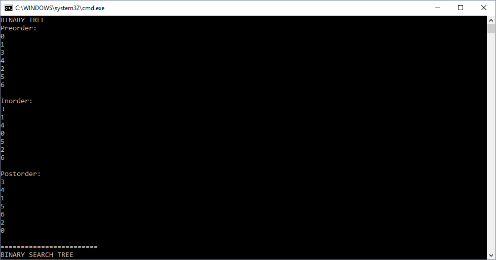

# Tree

## Description/Challenge
Implement a binary tree and a binary search tree. The binary tree should have a preorder, inorder, and postorder method that each return a list of the nodes in the tree in their respective orders. The binary search tree should have a search tree that can perform a binary search for an exisiting node adn then return that node. The binary search tree should also have an add method that adds a node in the correct spot inside the ordered tree.

## Linked List Methods
### Binary Tree
Big O - 
Time: O(h) 
Space: O(1) 

1. PreOrder()
    * This method returns a list of the nodes in a tree ordered like ROOT -> LEFT -> RIGHT
    * The time this takes depends on the height of the tree determined by the amount of edges it has

2. InOrder()
    * This method returns a list of the nodes in a tree ordered like LEFT -> ROOT -> RIGHT
    * The time this takes depends on the height of the tree determined by the amount of edges it has

3. PostOrder()
    * This method returns a list of the nodes in a tree ordered like LEFT -> RIGHT -> ROOT
    * The time this takes depends on the height of the tree determined by the amount of edges it has

### 
Big O - 
Time: O(log n) 
Space: O(1) 

1. Search()
    * This method searches for a specific node in a binary search tree. This method will never have to search more than half of a tree's nodes

2. Add()
    * This method adds a new node to the correct place in a binary search tree. This method will never have to search more than half of a tree's nodes to add.

## Visual Example Of Binary Tree Traversal
### Depth First Traversals
